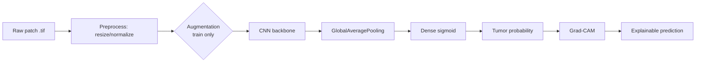
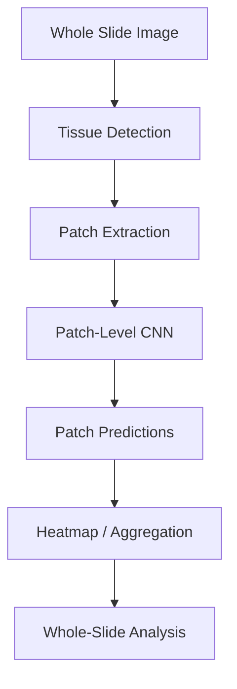

# Deep Learning-Based Histopathology Image Analysis for Metastatic Cancer Detection

A patch-level deep learning system for detecting metastatic tissue in histopathologic
lymph-node scans, built on the Kaggle Histopathologic Cancer Detection (PatchCamelyon)
dataset. This is a **research/educational prototype**, not a clinical diagnostic tool.

> This repository is an upgrade of an earlier working notebook (`Histopathologic_Cancer_Detection-Copy1.ipynb`).
> See `notebooks/histopathology_analysis.ipynb` → "Current Notebook Assessment" for exactly
> what was preserved, fixed, and added, and why.

## 1. Problem Statement

Given a 96x96 RGB patch cropped from a digitized H&E-stained lymph-node section, predict
whether the **center 32x32px region** contains metastatic tumor tissue. This is the task
defined by the PatchCamelyon benchmark and the Kaggle Histopathologic Cancer Detection
competition.

## 2. Motivation

Manual review of whole-slide pathology images for metastases is slow, and small
metastatic foci are easy for even expert pathologists to miss across a large tissue area.
An automated patch classifier can act as a triage/second-reader tool, flagging regions
for closer human review — the same idea underlying the CAMELYON challenges.

## 3. Dataset

- **Source**: [Kaggle — Histopathologic Cancer Detection](https://www.kaggle.com/c/histopathologic-cancer-detection/data), a de-duplicated variant of **PatchCamelyon (PCam)**.
- **Size** (per the labels file): 220,025 labeled training patches, 57,458 unlabeled patches in the Kaggle `test/` folder (submission-only — no ground truth available offline).
- **Format**: 96x96 RGB `.tif` patches, binary label per patch (`train_labels.csv`).
- **No patient/slide identifiers** and **no segmentation masks** are provided — both are explicit, stated limitations that shape the Data Leakage and Segmentation sections below rather than being worked around.

## 4. Architecture



Two classification backbones are compared on the same pipeline:

1. **Xception + MobileNetV2 ensemble** (preserved baseline from the original notebook) — dual-branch feature concatenation.
2. **EfficientNetB0** (added) — a single modern transfer-learning backbone.

## 5. Data Preprocessing

- `tf.data` pipeline reading directly from the labels dataframe (no on-disk copy of the dataset into class folders, unlike the original notebook).
- Resize to 96x96 (native resolution — avoids upscaling artifacts), normalize to `[0, 1]`.
- Augmentation: horizontal/vertical flip, full rotation, mild zoom, mild contrast jitter — chosen because tissue has no canonical orientation, and kept mild specifically so the label-defining center 32x32px region isn't invalidated by aggressive shifts/shear (see notebook for the full rationale).

## 6. Classification

Both backbones are trained with the same `tf.data` pipeline, the same held-out validation
split, and the same class-imbalance strategy (configurable: undersampling to reproduce the
original approach, or class-weighted loss to use the full dataset — see `src/train.py`).

## 7. Patch-Based Processing

The dataset is already patch-level; the notebook explains *why* patch-based processing is
the standard approach for whole-slide images generally (memory/compute constraints of
40x-scale WSIs) and includes a reusable tiling utility (`extract_patches`) demonstrated on
a synthetic canvas, since no real whole-slide-image file is part of this dataset.



## 8. Segmentation

**Not implemented against this dataset** — no pixel-level masks exist in the Kaggle
Histopathologic Cancer Detection download. A U-Net architecture (`src/models.py::build_unet`)
is provided as an implementation plan for when CAMELYON-style annotated masks are available,
along with the intended Dice/IoU evaluation. See the notebook's "Segmentation Extension"
section for the full reasoning — labels are never repurposed as masks.

## 9. Explainability

Grad-CAM (`src/explainability.py`) highlights which regions of a patch most influenced a
given prediction. Documented limitation: Grad-CAM reflects gradient-weighted feature
importance, not medical correctness, and can be spatially coarse on small 96x96 inputs.

## 10. Evaluation

Accuracy, precision, recall/sensitivity, specificity, F1, ROC-AUC, and confusion matrix
(`src/evaluate.py::evaluate_model`) — accuracy alone is intentionally not the headline
metric (see notebook Step 7 for why sensitivity matters more in cancer screening).

## 11. Error Analysis

`src/evaluate.py::error_analysis` surfaces false positives, false negatives, and
low-confidence predictions with the actual patch images, for qualitative review
(staining variation, artifacts, boundary-ambiguous center crops, etc.).

## 12. Results

| Model | Accuracy | Precision | Recall (Sensitivity) | Specificity | F1 | ROC-AUC |
|---|---|---|---|---|---|---|
| Xception + MobileNetV2 ensemble | Not yet trained | Not yet trained | Not yet trained | Not yet trained | Not yet trained | Not yet trained |
| EfficientNetB0 | 79.40% | 70.53% | 84.41% | 75.99% | 76.85% | 0.8888 |

*(EfficientNetB0 result from a real training run: frozen ImageNet backbone, 8 effective epochs — best epoch selected by `EarlyStopping(monitor='val_auc', patience=3)` out of a 10-epoch budget — on a 90/10 stratified validation split of the labeled training data. Ensemble baseline not yet trained; see Future Work.)*

**These are template rows until you have real numbers — the EfficientNetB0 row above is now filled in from an actual run** (metrics CSV + confusion matrix + ROC curve saved under `outputs/`). The ensemble row is still a template — train it the same way (`train_model(ensemble_model, ...)`) if you want the direct comparison this table is designed for.

## 13. Inference

```python
from src.inference import predict_image
import tensorflow as tf

model = tf.keras.models.load_model("models/efficientnet_best.keras")
result = predict_image("path/to/patch.tif", model, last_conv_layer_name="top_conv")
print(result["predicted_class"], result["confidence"])
```

## 14. GUI

A minimal Gradio app (`app/app.py`) wraps `predict_image()`: upload a patch, see the
predicted class, confidence, and Grad-CAM overlay.

```bash
python app/app.py --model-path ./models/efficientnet_best.keras
```

## 15. Limitations

- No patient/slide-level split possible (no such identifiers in the dataset) — patch-level splitting is used instead, a known source of potential (if modest, given de-duplication) train/val leakage risk.
- No segmentation masks — segmentation is architecture-only, untrained.
- No real whole-slide-image file to demonstrate the WSI extension against — shown on a synthetic canvas instead.
- All metrics/benchmarks in this repo are templates until run against the real dataset on real hardware; nothing here is a fabricated number.
- Not a clinical device; no regulatory validation.

## 16. Future Work

- Obtain CAMELYON16/17 slide-level annotations to actually train/evaluate the U-Net segmentation plan.
- Slide/patient-level cross-validation if identifiers become available.
- Model compression (quantization/pruning) for edge/CPU deployment at whole-slide scale.
- Uncertainty estimation (e.g. MC-Dropout or an ensemble) to flag low-confidence tiles for mandatory human review.

## 17. Installation

**Option A — Kaggle (recommended, this is what the notebook is configured for):**
Upload `notebooks/histopathology_analysis.ipynb` to Kaggle, attach the
"Histopathologic Cancer Detection" competition data, and set
**Settings -> Accelerator -> GPU**. The `Config` block auto-detects `/kaggle/input/...`
and writes outputs to `/kaggle/working/...` — no path edits needed.

**Option B — local/other environment:**
```bash
git clone <this-repo>
cd histopathology-ai
pip install -r requirements.txt
export HCD_DATA_DIR=/path/to/kaggle/histopathologic-cancer-detection
```

## 18. Usage

```bash
# Train (local/CLI - on Kaggle, just run the notebook cells instead)
python -m src.train --data-dir $HCD_DATA_DIR --model efficientnet --epochs 15

# Run the Gradio demo
python app/app.py --model-path ./models/efficientnet_best.keras
```

Or open `notebooks/histopathology_analysis.ipynb` for the full, annotated, cell-by-cell
walkthrough (EDA, leakage checks, training, evaluation, explainability, error analysis,
and generating a `submission.csv` for the Kaggle leaderboard).

## Tech Stack

Python, TensorFlow/Keras, OpenCV, scikit-learn, Grad-CAM, Gradio — chosen because each is
actually used in the pipeline above (no technology added just to lengthen this list).
